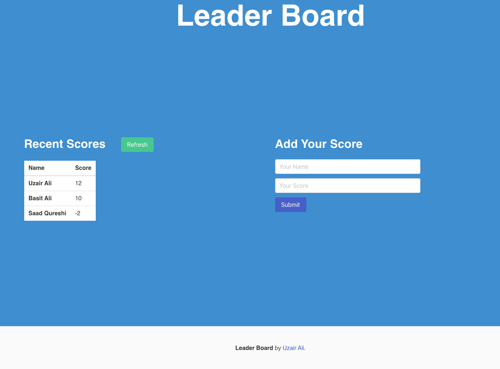

# Leaderboard with Webpack

> Basic website that allows users to enter name and score to record themselves on the leaderboard. Have a name for yourself.

## Built With

- Javascript
- HTML
- CSS
- Webpack



## Getting Started

To get a local copy up and running follow these simple example steps.

### Setup

Run 

```bash
# To clone the git repositories
git clone https://github.com/uzairali19/leaderboard.git

# To install dependencies 
npm install 

# To run development branch
npm run start
````

### Run tests

For Linters:

```bash
# To check for HTML errors
npx hint .

# To check for CSS errors
npx stylelint "**/*.{css,scss}"

# To check for Javascript errors
npx eslint .
```

## Authors

👤 **Uzair Ali**

- GitHub: [@uzairali19](https://github.com/uzairali19)
- Twitter: [@uzairali751](https://twitter.com/Uzairali751)
- LinkedIn: [Uzair Ali](https://www.linkedin.com/in/uzair-ali-964187166/)

## 🤝 Contributing

Contributions, issues, and feature requests are welcome!

Feel free to check the [issues page](https://github.com/uzairali19/leaderboard/issues/).

## Show your support

Give a ⭐️ if you like this project!

## 📝 License

This project is [MIT](./MIT.md) licensed.
